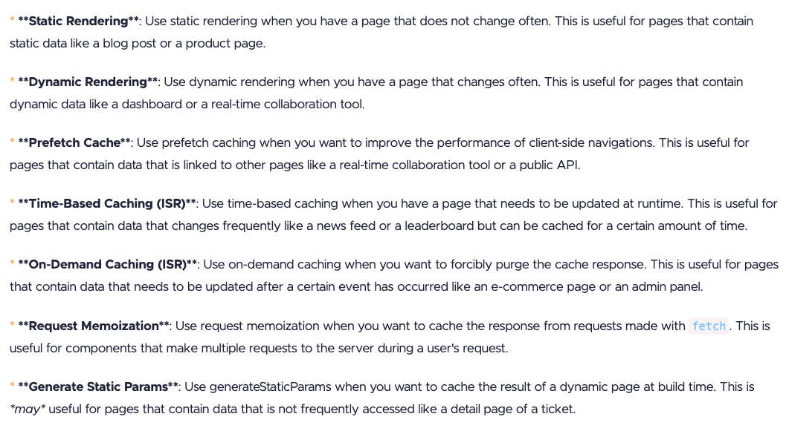

## Misc

- Plugin for sorting imports `eslint-plugin-simple-import-sort`
  - see usage example in [eslint config](./the-road-to-next-app/eslint.config.mjs)
- Absolute imports can be used in Next.js by adding a `@` prefix to the import path.
  - E.g. `import { data } from "@/data.ts"` instead of `import { data } from "../../../data.ts"` (assuming the file is in `/src` folder)
- Component composition pattern (passing children as props`<AppProvider>{children}</AppProvider>`) can be used to avoid propagating client components (`"use client"`) down the tree.

## Routing
- Dynamic route can be created by using square brackets in the file name. E.g. `app/tickets/[ticketId]/page.tsx`.

- Params of a route can be accessed using `useParams` hook. E.g. `const { ticketId } = useParams();` This approach however converts the route to a client component. Other way to access the params is via props:
```tsx
type TicketPageProps = {
  params: Promise<{ ticketId: string }>;
};

const TicketPage = async ({ params }: TicketPageProps) => {
  const { ticketId } = await params;

  return <h1 className="text-lg">Ticket Page {ticketId}</h1>;
};

export default TicketPage;
```

- Path constants can be used to make the code more maintainable. See usage example in [paths.ts](./the-road-to-next-app/src/paths.ts).
```tsx
import { ticketPath } from "@/paths";
/* ... */
<Link href={ticketPath(ticket.id)}>View</Link>
/* ... */
```

- Redirects can be done using `redirect` function from `next/navigation` package. E.g. `redirect("/tickets");`

## Typescript
- ts errors can be checked using `npm run type` command with `"type": "tsc --noEmit"` in package.json scripts.
- const assertions can be used for literal types, e.g. `let x = "hello" as const;`, type is `"hello"`, not `string`.

## Tailwind
Useful tailwind VSCode extensions:
- Tailwind CSS IntelliSense
- Tailwind Fold (`ctrl + opt + a`)
- Tailwind Docs (`cmd + shift + p`)

Conditional classes can be used with `clsx` package, e.g.
```tsx
import clsx from "clsx";
/* ... */
/* The default styles here are `text-sm text-slate-400 truncate`, line-through is added if the ticket status is DONE */
<p
  className={clsx("text-sm text-slate-400 truncate", {
    "line-through": ticket.status === "DONE",
  })}
>
  {ticket.content}
</p>
/* ... */
```

Custom animations in tailwind can be added to `globals.css` file:
```css
@theme inline {
  --animate-fade-from-top: fade-from-top 0.5s ease-out;

  @keyframes fade-from-top {
    0% {
      opacity: 0;
      transform: translateY(-16px);
    }

    100% {
      opacity: 1;
      transform: translateY(0);
    }
  }
}
```
and then used in the component:
```tsx
<div className="flex-1 flex flex-col animate-fade-from-top">
...
</div>
```

## shadcn/ui

- `npx shadcn@latest init` - installs the shadcn/ui package and sets up the project with the necessary files and configurations.
- `npx shadcn@latest add button` - adds the button component to the project
- component files are created in `src/components/ui` folder and can be used in the project like this:
```tsx
import { Button, buttonVariants } from "@/components/ui/button";
/* ... */
<Button asChild variant="outline">
  <Link href={homePath}>Home</Link>
</Button>

// OR

<Link
  href={ticketsPath}
  className={buttonVariants({
    variant: "outline",
  })}
>
  Tickets
</Link>
/* ... */
```
- icons can be imported from `lucide-react` package, which is included with shadcn/ui, e.g.
```tsx
import { LucideCircleCheck, LucideFileText, LucidePencil } from "lucide-react";

const TICKET_ICONS = {
  OPEN: <LucideFileText />,
  IN_PROGRESS: <LucidePencil />,
  DONE: <LucideCircleCheck />,
};
```
- theme variables can be generated via the website and added to the project

## Dark mode

- Dark mode switching can be implemented using `next-themes` package.

1. [theme-provider.tsx](./the-road-to-next-app/src/components/theme/theme-provider.tsx)
2. [theme-switcher.tsx](./the-road-to-next-app//src/components/theme/theme-switcher.tsx)
3. [ThemeProvider in main layout](./the-road-to-next-app/src/app/layout.tsx)
4. [dark theme color variables in global styles](./the-road-to-next-app/src/app/globals.css)

## Data fetching, streaming, suspense & fallbacks

- Data can be fetched in server components by using async/await syntax, e.g.
```tsx
import { getTicket } from "@/features/ticket/queries/get-ticket";

const TicketPage = async () => {
  const ticket = await getTicket(params.ticketId);

  return (
   /* ... */
  );
};
```

- `<Suspense>` component can be used to show a fallback UI (spinner, etc.) while the data is being fetched, e.g.
```tsx
import { Suspense } from "react";
import { TicketList } from "@/features/ticket/components/ticket-list";
import { Spinner } from "@/features/ticket/components/ticket-list-skeleton";

const TicketListPage = async () => {

  return (
    <>
      <Suspense fallback={<Spinner />}>
      // data is fetched inside TicketList component
        <TicketList />
      </Suspense>
    </>
  );
};
export default TicketListPage;
```

- Whole page loading can be also implemented by creating a `loading.tsx` file in the same folder as the page, e.g. [loading.tsx](./the-road-to-next-app/src/app/tickets/[ticketId]/loading.tsx)
- Error cases can be handled in the same way by creating an `error.tsx` file, e.g. [error.tsx](./the-road-to-next-app/src/app/tickets/error.tsx)
  - or by using `ErrorBoundary` component from `react-error-boundary` package, e.g.
  ```tsx
  import { ErrorBoundary } from "react-error-boundary";
  import { TicketList } from "@/features/ticket/components/ticket-list";

  const TicketListPage = async () => {
    return (
      <>
        <ErrorBoundary fallback="Something went wrong!">
          <TicketList />
        </ErrorBoundary>
      </>
    );
  };
  export default TicketListPage;
  ```
- A not found case can be handled with a `not-found.tsx` file, e.g. [not-found.tsx](./the-road-to-next-app/src/app/tickets/[ticketId]/not-found.tsx). It can be used in combination with `notFound()` function from `next/navigation` package, e.g. [ticket.tsx](./the-road-to-next-app/src/app/tickets/[ticketId]/page.tsx)

## DB & ORM
- https://supabase.com/dashboard/project/
- `npm i prisma --save-dev`
- `npm install @prisma/client` installs the Prisma Client package
- `npx prisma init` initializes Prisma in the project & generates [schema.prisma](./the-road-to-next-app/prisma/schema.prisma)
- `npx prisma generate` updates the generated Prisma Client code
- add `"postinstall": "prisma generate"` to `package.json` scripts
- add `directUrl = env("DIRECT_URL")` to the datasource block in [schema.prisma](./the-road-to-next-app/prisma/schema.prisma)
- `npx prisma db push` to push the schema to the database
- data can be seeded to the DB using `PrismaClient`, e.g. [seed.ts](./the-road-to-next-app/prisma/seed.ts)
- DB data can be accessed via the Prisma Studio - `npx prisma studio`, http://localhost:5555/
- Prisma workaround for Next.js to prevent hot reloading issues [prisma.ts](./the-road-to-next-app/src/lib/prisma.ts)
  - prisma then can be used in the app like in [get-ticket.ts](./the-road-to-next-app/src/features/ticket/queries/get-ticket.ts) & [page.tsx](./the-road-to-next-app/src/app/tickets/[ticketId]/page.tsx)
- Types from Prisma Client can be used in the app, e.g. like in [ticket-item.tsx](./the-road-to-next-app/src/features/ticket/components/ticket-item.tsx)

## Server actions
- Server actions can be used to perform mutations on the server side. They are defined in the separate file and marked with `"use server"` directive. They can be called from client components as follows:

*[delete-ticket.ts](./the-road-to-next-app/src/features/ticket/actions/delete-ticket.ts)*
```ts
"use server";

import { prisma } from "@/lib/prisma";

export const deleteTicket = async (id: string) => {
  await prisma.ticket.delete({
    where: {
      id,
    },
  });
};
```
*Component.tsx*
```tsx
"use client";

import { deleteTicket } from "@/features/ticket/actions/delete-ticket";
/* ... */
const handleDelete = async (id: string) => {
  await deleteTicket(id);
};
/* ... */
<button onClick={() => handleDelete(ticket.id)}>
  Delete
</button>
```

- Server action can be used in a server component as well, with `action` attribute in the form element:
*[Component.tsx](./the-road-to-next-app/src/features/ticket/components/ticket-item.tsx)*
```tsx
import { deleteTicket } from "@/features/ticket/actions/delete-ticket";
/* ... */
const deleteButton = (
  <form action={deleteTicket.bind(null, ticket.id)}>
    <Button variant="outline" size="icon">
      <LucideTrash className="h4 w-4" />
    </Button>
  </form>
);
/* ... */
```

## Caching

- Dev - `npm run dev`
- Prod - `npm run build` then `npm run start`

Caching can be turned on in production by using experimental `staleTimes` option in `next.config.js` file.

`prefetch` flag in a `Link` component enables prefetching of the page data, it is enabled by default in production.

- Next.js uses a static rendering by default (for non-dynamic routes), we can opt-out of it by using `export const dynamic = "force-dynamic";` in the page component.

- Dynamic revalidation of a static page can be also done with `export const revalidate = 10;` in the page component. This will revalidate the page every 10 seconds. Passing `0` will make a page kind of dynamic.

- On demand caching can be done with `revalidatePath` adding function from `next/cache` package to the action. It can be used to revalidate a specific path in the cache. E.g. [page.tsx](./the-road-to-next-app/src/features/ticket/actions/delete-ticket.ts).

- `cache` from react can be used for request memoization - `import { cache } from "react"` and then wrap a fetch function with it.

- `generateStaticParams` function can be used to generate static params for a dynamic route [docs](https://nextjs.org/docs/app/api-reference/functions/generate-static-params)
```js
export async function generateStaticParams() {
  const tickets = await getTickets();

  return tickets.map((ticket) => ({
    ticketId: ticket.id,
  }));
}
```



## Forms

[Ticket upsert form](./the-road-to-next-app/src/features/ticket/components/ticket-upsert-form.tsx) is an example of implementing a form in Next.js with server actions. In this case, the form is used to create or update a ticket.

- `useTransition` hook from `react` is used to show a loading state while the form is being submitted

- `useFormStatus` hook from `react-dom` can be also used for similar purpose

- `useActionState` hook from `react` can be used for displaying information about the form submission state, etc. [docs](https://react.dev/reference/react/useActionState)

### Form validation & error handling
- `npm i zod`
- create a schema, [upsert-ticket.ts](./the-road-to-next-app/src/features/ticket/actions/upsert-ticket.ts)
- define an error handling logics [to-action-state.ts](./the-road-to-next-app/src/components/form/utils/to-action-state.ts)
- use schema and the error handling logics in the action function [upsert-ticket.ts](./the-road-to-next-app/src/features/ticket/actions/upsert-ticket.ts)
- use the action function (upsertTicket) in the form [ticket-upsert-form.tsx](./the-road-to-next-app/src/features/ticket/components/ticket-upsert-form.tsx)
- display the error messages in the form [form.tsx](./the-road-to-next-app/src/components/form/form.tsx) (form abstraction)
- toaster notifications can be implemented with `npm i sonner` package as a one option, with `<Toaster/>` component in the main layout and `toast.success` or `toast.error` methods. [form.tsx](./the-road-to-next-app/src/components/form/form.tsx) - in this case we are also using custom `useActionFeedback` hook to show the toast notifications [use-action-feedback.ts](./the-road-to-next-app/src/components/form/hooks/use-action-feedback.ts)

## Cookies
- cookies can be handled with `cookies` from the `next/headers` package, e.g. [cookies.tsx](./the-road-to-next-app/src/actions/cookies.tsx)
- in our case cookies are set in the [upsert-ticket.ts](./the-road-to-next-app/src/features/ticket/actions/upsert-ticket.ts) and [delete-ticket.ts](./the-road-to-next-app/src/features/ticket/actions/delete-ticket.ts) actions
- cookies functions are then used in the [redirect-toast.tsx](./the-road-to-next-app/src/components/redirect-toast.tsx) component to show the toast notifications - `<RedirectToast />` component is used in the tickets and a single ticket pages for rendering the toast notifications after redirecting
