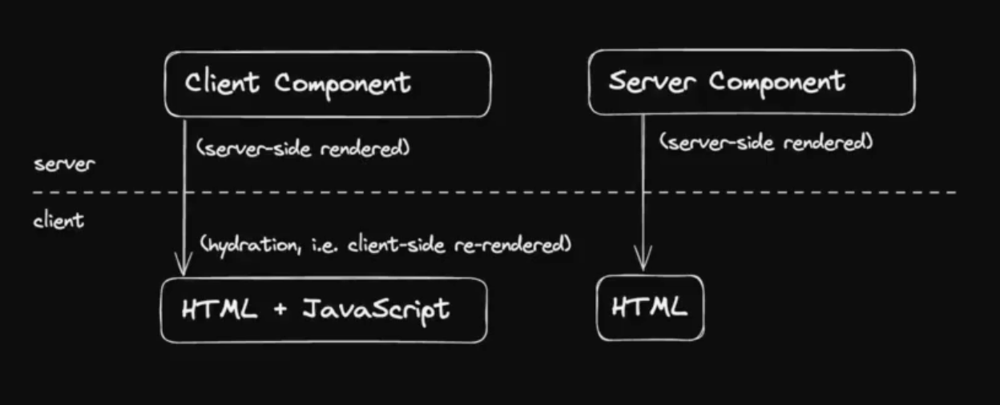
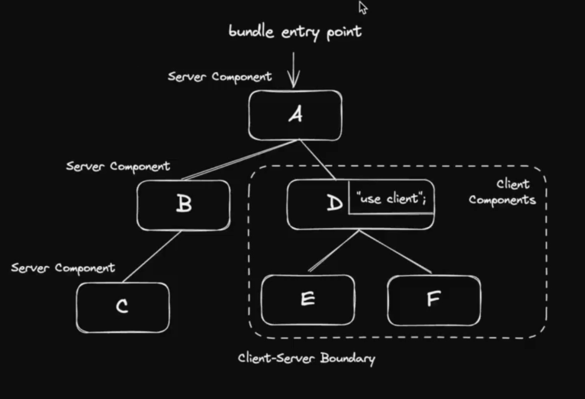
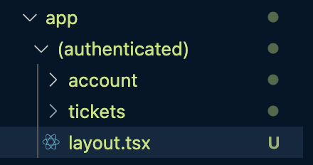
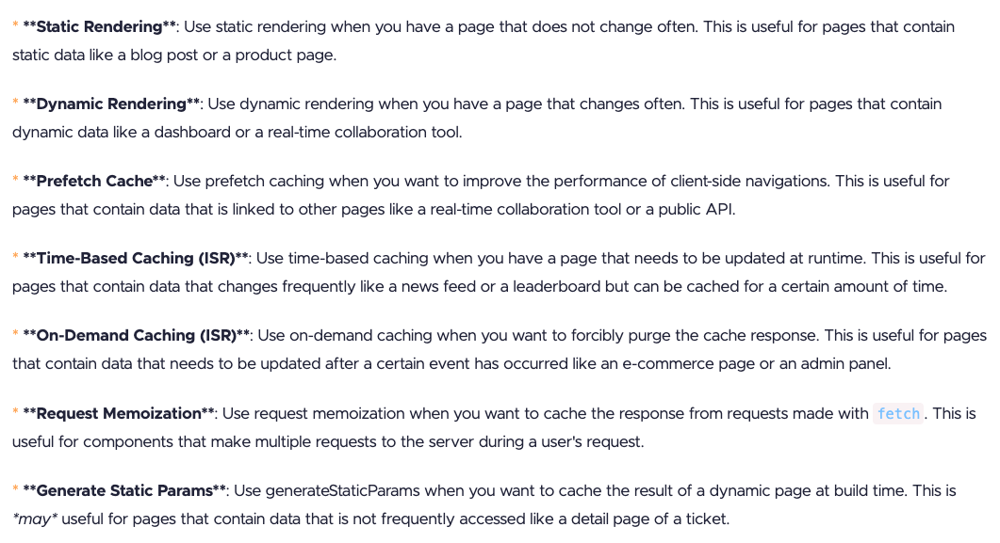
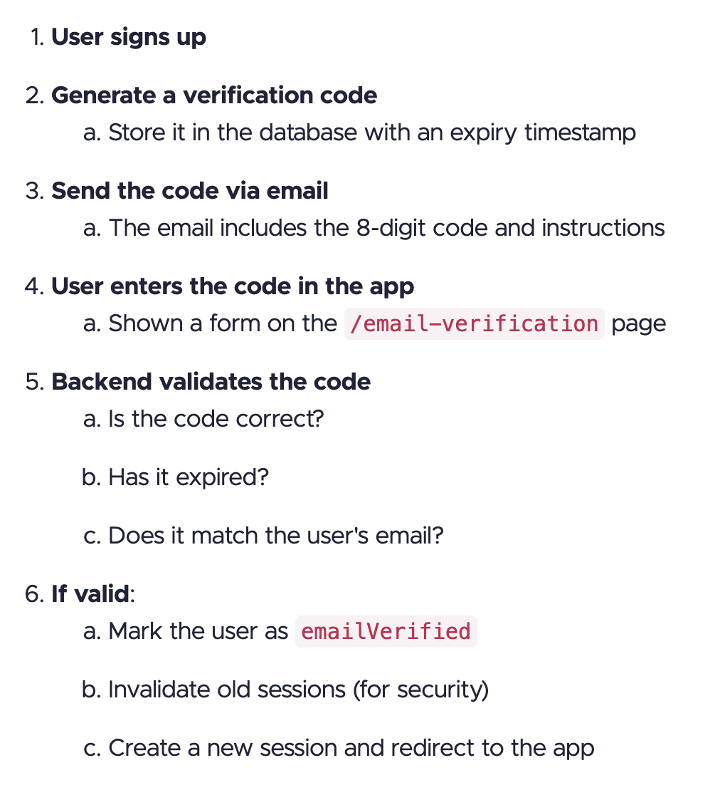

## Misc

- Plugin for sorting imports `eslint-plugin-simple-import-sort`
  - see usage example in [eslint config](./the-road-to-next-app/eslint.config.mjs)
- Absolute imports can be used in Next.js by adding a `@` prefix to the import path.
  - E.g. `import { data } from "@/data.ts"` instead of `import { data } from "../../../data.ts"` (assuming the file is in `/src` folder)
- Component composition pattern (passing children as props `<AppProvider>{children}</AppProvider>`) can be used to avoid propagating client components (`"use client"`) down the tree. This way we can have a sever component inside a client component without issues by passing the server component as a prop.
- Example of working with currencies using a `big.js` package - [utils/currency.ts](./the-road-to-next-app/src/utils/currency.ts), [lib/big.ts](./the-road-to-next-app/src/lib/big.ts)
- Providing a key to a component can be used to force re-rendering of the component. E.g. `<DatePicker key={Date.now()} />` or `<DatePicker key={actiopnState.timeStamp} />` this will re-render the component when the key changes.
- Example of a API route implementation [src/app/api/tickets/route.ts](./the-road-to-next-app/src/app/api/tickets/route.ts) & [src/app/api/tickets/[ticketId]/route.ts](./the-road-to-next-app/src/app/api/tickets/[ticketId]/route.ts)
- Both client and server components are rendered on the server in Next.js. The difference is that client components are hydrated on the client side, while server components are not. This means that client components can use client JS, event handlers, browser APIs and hooks like `useState`, `useEffect`, etc.



## Routing
- Dynamic route can be created by using square brackets in the file name. E.g. `app/tickets/[ticketId]/page.tsx`.

- Params of a route can be accessed using `useParams` hook. E.g. `const { ticketId } = useParams();` This approach however converts the route to a client component. Other way to access the params is via props:
```tsx
type TicketPageProps = {
  params: Promise<{ ticketId: string }>;
};

const TicketPage = async ({ params }: TicketPageProps) => {
  const { ticketId } = await params;

  return <h1 className="text-lg">Ticket Page {ticketId}</h1>;
};

export default TicketPage;
```

- Path constants can be used to make the code more maintainable. See usage example in [paths.ts](./the-road-to-next-app/src/paths.ts).
```tsx
import { ticketPath } from "@/paths";
/* ... */
<Link href={ticketPath(ticket.id)}>View</Link>
/* ... */
```

- Redirects can be done using `redirect` function from `next/navigation` package. E.g. `redirect("/tickets");`

- Routes can be organized in route groups using parentheses in the folder name. In the example below we have a route group for routes that need authentication - the check happens in the `layout.tsx`.


- Private folders can be used for moving components closer to the page they are used in. The private folder should be marked with a `_` prefix. E.g. `app/(authenticated)/account/_navigation`. Private folders do not create a route segment and are not accessible via URL.

## Typescript
- ts errors can be checked using `npm run type` command with `"type": "tsc --noEmit"` in package.json scripts.
- const assertions can be used for literal types, e.g. `let x = "hello" as const;`, type is `"hello"`, not `string`.

## Tailwind
Useful tailwind VSCode extensions:
- Tailwind CSS IntelliSense
- Tailwind Fold (`ctrl + opt + a`)
- Tailwind Docs (`cmd + shift + p`)

Conditional classes can be used with `clsx` package, e.g.
```tsx
import clsx from "clsx";
/* ... */
/* The default styles here are `text-sm text-slate-400 truncate`, line-through is added if the ticket status is DONE */
<p
  className={clsx("text-sm text-slate-400 truncate", {
    "line-through": ticket.status === "DONE",
  })}
>
  {ticket.content}
</p>
/* ... */
```

Custom animations in tailwind can be added to `globals.css` file:
```css
@theme inline {
  --animate-fade-from-top: fade-from-top 0.5s ease-out;

  @keyframes fade-from-top {
    0% {
      opacity: 0;
      transform: translateY(-16px);
    }

    100% {
      opacity: 1;
      transform: translateY(0);
    }
  }
}
```
and then used in the component:
```tsx
<div className="flex-1 flex flex-col animate-fade-from-top">
...
</div>
```

## shadcn/ui

- `npx shadcn@latest init` - installs the shadcn/ui package and sets up the project with the necessary files and configurations.
- `npx shadcn@latest add button` - adds the button component to the project
- component files are created in `src/components/ui` folder and can be used in the project like this:
```tsx
import { Button, buttonVariants } from "@/components/ui/button";
/* ... */
<Button asChild variant="outline">
  <Link href={homePath}>Home</Link>
</Button>

// OR

<Link
  href={ticketsPath}
  className={buttonVariants({
    variant: "outline",
  })}
>
  Tickets
</Link>
/* ... */
```
- icons can be imported from `lucide-react` package, which is included with shadcn/ui, e.g.
```tsx
import { LucideCircleCheck, LucideFileText, LucidePencil } from "lucide-react";

const TICKET_ICONS = {
  OPEN: <LucideFileText />,
  IN_PROGRESS: <LucidePencil />,
  DONE: <LucideCircleCheck />,
};
```
- theme variables can be generated via the website and added to the project

## Dark mode

- Dark mode switching can be implemented using `next-themes` package.

1. [theme-provider.tsx](./the-road-to-next-app/src/components/theme/theme-provider.tsx)
2. [theme-switcher.tsx](./the-road-to-next-app//src/components/theme/theme-switcher.tsx)
3. [ThemeProvider in main layout](./the-road-to-next-app/src/app/layout.tsx)
4. [dark theme color variables in global styles](./the-road-to-next-app/src/app/globals.css)

## Data fetching, streaming, suspense & fallbacks

- Data can be fetched in server components by using async/await syntax, e.g.
```tsx
import { getTicket } from "@/features/ticket/queries/get-ticket";

const TicketPage = async () => {
  const ticket = await getTicket(params.ticketId);

  return (
   /* ... */
  );
};
```

- `<Suspense>` component can be used to show a fallback UI (spinner, skeletonm etc.) while the data is being fetched, e.g.
```tsx
import { Suspense } from "react";
import { TicketList } from "@/features/ticket/components/ticket-list";
import { Spinner } from "@/features/ticket/components/ticket-list-skeleton";

const TicketListPage = async () => {

  return (
    <>
      <Suspense fallback={<Spinner />}>
      // data is fetched inside TicketList component
        <TicketList />
      </Suspense>
    </>
  );
};
export default TicketListPage;
```

- Whole page loading can be also implemented by creating a `loading.tsx` file in the same folder as the page, e.g. [loading.tsx](./the-road-to-next-app/src/app/(authenticated)/tickets/[ticketId]/loading.tsx)
- Error cases can be handled in the same way by creating an `error.tsx` file, e.g. [error.tsx](./the-road-to-next-app/src/app/(authenticated)/tickets/error.tsx)
  - or by using `ErrorBoundary` component from `react-error-boundary` package, e.g.
  ```tsx
  import { ErrorBoundary } from "react-error-boundary";
  import { TicketList } from "@/features/ticket/components/ticket-list";

  const TicketListPage = async () => {
    return (
      <>
        <ErrorBoundary fallback="Something went wrong!">
          <TicketList />
        </ErrorBoundary>
      </>
    );
  };
  export default TicketListPage;
  ```
- A not found case can be handled with a `not-found.tsx` file, e.g. [not-found.tsx](./the-road-to-next-app/src/app/(authenticated)/tickets/[ticketId]/not-found.tsx). It can be used in combination with `notFound()` function from `next/navigation` package, e.g. [ticket.tsx](./the-road-to-next-app/src/app/(authenticated)/tickets/[ticketId]/page.tsx)
- A data fetching can be improved by lifting the data fetching logic up and fetching in parallel, e.g. in the [ticket.tsx](./the-road-to-next-app/src/app/(authenticated)/tickets/[ticketId]/page.tsx) we are fetching ticket and comments data in parallel using `Promise.all([getTicket(ticketId), getComments(ticketId)])` and then destructuring the results.

## DB & ORM
- https://supabase.com/dashboard/project/
- `npm i prisma --save-dev`
- `npm install @prisma/client` installs the Prisma Client package
- `npx prisma init` initializes Prisma in the project & generates [schema.prisma](./the-road-to-next-app/prisma/schema.prisma)
- `npx prisma generate` updates the generated Prisma Client code
- add `"postinstall": "prisma generate"` to `package.json` scripts
- add `directUrl = env("DIRECT_URL")` to the datasource block in [schema.prisma](./the-road-to-next-app/prisma/schema.prisma)
- `npx prisma db push` to push the schema to the database
- data can be seeded to the DB using `PrismaClient`, e.g. [seed.ts](./the-road-to-next-app/prisma/seed.ts)
- DB data can be accessed via the Prisma Studio - `npx prisma studio`, http://localhost:5555/
- Prisma workaround for Next.js to prevent hot reloading issues [prisma.ts](./the-road-to-next-app/src/lib/prisma.ts)
  - prisma then can be used in the app like in [get-ticket.ts](./the-road-to-next-app/src/features/ticket/queries/get-ticket.ts) & [page.tsx](./the-road-to-next-app/src/app/(authenticated)/tickets/[ticketId]/page.tsx)
- Types from Prisma Client can be used in the app, e.g. like in [ticket-item.tsx](./the-road-to-next-app/src/features/ticket/components/ticket-item.tsx)

### DB migration
- after schema changes run `npx prisma db push` to push the changes to the DB (new fields should have default values)
- `npm run type` can be used to detect type errors after the changes

### DB patterns
- One-to-Many Relation or other types of relations can be defined in the [schema.prisma](./the-road-to-next-app/prisma/schema.prisma) file, e.g. see `User` and `Ticket` models, those relations should be then taken into account in queries, e.g. in [seed.ts](./the-road-to-next-app/prisma/seed.ts) where we creating users and then assigning tickets to them
- Example of a Many-to-One Relation in the [schema.prisma](./the-road-to-next-app/prisma/schema.prisma) is `Comment` and `Ticket` models

## Server actions
- Server actions can be used to perform mutations on the server side. They are defined in the separate file and marked with `"use server"` directive. They can be called from client components as follows:

*[delete-ticket.ts](./the-road-to-next-app/src/features/ticket/actions/delete-ticket.ts)*
```ts
"use server";

import { prisma } from "@/lib/prisma";

export const deleteTicket = async (id: string) => {
  await prisma.ticket.delete({
    where: {
      id,
    },
  });
};
```
*Component.tsx*
```tsx
"use client";

import { deleteTicket } from "@/features/ticket/actions/delete-ticket";
/* ... */
const handleDelete = async (id: string) => {
  await deleteTicket(id);
};
/* ... */
<button onClick={() => handleDelete(ticket.id)}>
  Delete
</button>
```

- Server action can be used in a server component as well, with `action` attribute in the form element:
*[Component.tsx](./the-road-to-next-app/src/features/ticket/components/ticket-item.tsx)*
```tsx
import { deleteTicket } from "@/features/ticket/actions/delete-ticket";
/* ... */
const deleteButton = (
  <form action={deleteTicket.bind(null, ticket.id)}>
    <Button variant="outline" size="icon">
      <LucideTrash className="h4 w-4" />
    </Button>
  </form>
);
/* ... */
```

## Caching

- Dev - `npm run dev`
- Prod - `npm run build` then `npm run start`

Caching can be turned on in production by using experimental `staleTimes` option in `next.config.js` file.

`prefetch` flag in a `Link` component enables prefetching of the page data, it is enabled by default in production.

- Next.js uses a static rendering by default (for non-dynamic routes), we can opt-out of it by using `export const dynamic = "force-dynamic";` in the page component.

- Dynamic revalidation of a static page can be also done with `export const revalidate = 10;` in the page component. This will revalidate the page every 10 seconds. Passing `0` will make a page kind of dynamic.

- On demand caching can be done with `revalidatePath` adding function from `next/cache` package to the action. It can be used to revalidate a specific path in the cache. E.g. [page.tsx](./the-road-to-next-app/src/features/ticket/actions/delete-ticket.ts).

- `cache` from react can be used for request memoization - `import { cache } from "react"` and then wrap a fetch function with it.

- `generateStaticParams` function can be used to generate static params for a dynamic route [docs](https://nextjs.org/docs/app/api-reference/functions/generate-static-params)
```js
export async function generateStaticParams() {
  const tickets = await getTickets();

  return tickets.map((ticket) => ({
    ticketId: ticket.id,
  }));
}
```



## Forms

[Ticket upsert form](./the-road-to-next-app/src/features/ticket/components/ticket-upsert-form.tsx) is an example of implementing a form in Next.js with server actions. In this case, the form is used to create or update a ticket.

- `useTransition` hook from `react` is used to show a loading state while the form is being submitted

- `useFormStatus` hook from `react-dom` can be also used for similar purpose

- `useActionState` hook from `react` can be used for displaying information about the form submission state, etc. [docs](https://react.dev/reference/react/useActionState)

### Form validation & error handling
- `npm i zod`
- create a schema, [upsert-ticket.ts](./the-road-to-next-app/src/features/ticket/actions/upsert-ticket.ts)
- define an error handling logics [to-action-state.ts](./the-road-to-next-app/src/components/form/utils/to-action-state.ts)
- use schema and the error handling logics in the action function [upsert-ticket.ts](./the-road-to-next-app/src/features/ticket/actions/upsert-ticket.ts)
- use the action function (upsertTicket) in the form [ticket-upsert-form.tsx](./the-road-to-next-app/src/features/ticket/components/ticket-upsert-form.tsx)
- display the error messages in the form [form.tsx](./the-road-to-next-app/src/components/form/form.tsx) (form abstraction)
- toaster notifications can be implemented with `npm i sonner` package as a one option, with `<Toaster/>` component in the main layout and `toast.success` or `toast.error` methods. [form.tsx](./the-road-to-next-app/src/components/form/form.tsx) - in this case we are also using custom `useActionFeedback` hook to show the toast notifications [use-action-feedback.ts](./the-road-to-next-app/src/components/form/hooks/use-action-feedback.ts)

## Cookies
- cookies can be handled with `cookies` from the `next/headers` package, e.g. [cookies.tsx](./the-road-to-next-app/src/actions/cookies.tsx)
- in our case cookies are set in the [upsert-ticket.ts](./the-road-to-next-app/src/features/ticket/actions/upsert-ticket.ts) and [delete-ticket.ts](./the-road-to-next-app/src/features/ticket/actions/delete-ticket.ts) actions
- cookies functions are then used in the [redirect-toast.tsx](./the-road-to-next-app/src/components/redirect-toast.tsx) component to show the toast notifications - `<RedirectToast />` component is used in the tickets and a single ticket pages (layout or template) for rendering the toast notifications after redirecting

## Authentication
- `npm i lucia @node-rs/argon2 @lucia-auth/adapter-prisma` - install lucia auth and related packages
- add user & session models to the [schema.prisma](./the-road-to-next-app/prisma/schema.prisma) file
- configure lucia auth in [lib/lucia.ts](./the-road-to-next-app/src/lib/lucia.ts)
- create paths for sign in, sign up and forgot password pages
- add a sign up form [sign-up-form.tsx](./the-road-to-next-app/src/features/auth/components/sign-up-form.tsx)
- add a schema and the sign up function [sign-up.ts](./the-road-to-next-app/src/features/auth/actions/sign-up.ts)
- add a sign in form [sign-in-form.tsx](./the-road-to-next-app/src/features/auth/components/sign-in-form.tsx) and a sign in function [sign-in.ts](./the-road-to-next-app/src/features/auth/actions/sign-in.ts) accordingly, logics remains the same
- sign out function utilizes `getAuth` query [get-auth.ts](./the-road-to-next-app/src/features/auth/actions/get-auth.ts) (returns user & session) which is used in the [sign-out.tsx](./the-road-to-next-app/src/features/auth/actions/sign-out.ts) action for session invalidation, we are also using it for dynamic rendering of header elements in [header.tsx](./the-road-to-next-app/src/app/_navigation/header.tsx) via the `useAuth` hook [use-auth.ts](./the-road-to-next-app/src/features/auth/hooks/use-auth.ts)
- NB! In the latest version the previous approach was slightly changed, migration from `lucia` to `oslo` package was done, more info here:
  - https://www.robinwieruch.de/how-to-roll-your-own-auth/
  - https://github.com/rwieruch/the-road-to-next-app/pull/9/commits/9a3c64970034b2fcc85b2ef52d3f9edb1369c669#diff-8cd785a50c02dddef720d852fcd8bf4071d2b95fa965933a4534c30de61fc870

## Authorization
- Routes and certain actions can/should be protected, this can be done for example with a `layout` component [layout.tsx](./the-road-to-next-app/src/app/(authenticated)/layout.tsx) which uses custom `getAuthOrRedirect` function [get-auth-or-redirect.ts](./the-road-to-next-app/src/features/auth/queries/get-auth-or-redirect.ts) to check if the user is authenticated and redirect to the sign in page if not - NB: however the layout approach is not sufficient for complete protection and can be bypassed with header manipulation
- The previous approach can be enhanced with a utility function that checks ownership of an entity [is-owner.ts](./the-road-to-next-app/src/features/auth/utils/is-owner.ts) -> [page.tsx](./the-road-to-next-app/src/app/(authenticated)/tickets/[ticketId]/edit/page.tsx)
- Actions should be also protected with ownership check, e.g. [upsert-ticket.ts](./the-road-to-next-app/src/features/ticket/actions/upsert-ticket.ts), [update-ticket-status.ts](./the-road-to-next-app/src/features/ticket/actions/update-ticket-status.ts), [delete-ticket.ts](./the-road-to-next-app/src/features/ticket/actions/delete-ticket.ts)
- Not-allowed operations should be hidden from the UI as well [ticket-item.tsx](./the-road-to-next-app/src/features/ticket/components/ticket-item.tsx)

## Navigation
The navigation can be implemented and enhanced with the following patterns:
- Breacrumbs [breadcrumbs.tsx](./the-road-to-next-app/src/components/breadcrumbs.tsx) -> used in ticket page [page.tsx](./the-road-to-next-app/src/app/(authenticated)/tickets/[ticketId]/page.tsx) and edit ticket page [edit/page.tsx](./the-road-to-next-app/src/app/(authenticated)/tickets/[ticketId]/edit/page.tsx)
- Sidebar [sidebar.tsx](./the-road-to-next-app/src/app/_navigation/sidebar) -> used in main layout [layout.tsx](./the-road-to-next-app/src/app/layout.tsx)
- Dropdown [account-dropdown.tsx](./the-road-to-next-app/src/app/_navigation/account-dropdown.tsx) -> used in [header.tsx](./the-road-to-next-app/src/app/_navigation/header.tsx)
- Tabs [account-tabs.tsx](./the-road-to-next-app/src/app/(authenticated)/account/_navigation/tabs.tsx) -> used in [heading.tsx](./the-road-to-next-app/src/components/heading.tsx)

## Search & sort
- Search component [search-input.tsx](./the-road-to-next-app/src/components/search-input.tsx)
- Sort component [sort-select.tsx](./the-road-to-next-app/src/components/sort-select.tsx)
- Components are used on the [ticket-list.tsx](./the-road-to-next-app/src/features/ticket/components/ticket-list.tsx) page via `getTickets` query [get-tickets.ts](./the-road-to-next-app/src/features/ticket/queries/get-tickets.ts)
- `nuqs` package can be used for easier handling of search params state

## Pagination
- Can be implemented with `searchParams` [search-params.ts](./the-road-to-next-app/src/features/ticket/search-params.ts) and `getTickets` query [get-tickets.ts](./the-road-to-next-app/src/features/ticket/queries/get-tickets.ts)
- Generic pagination component [pagination.tsx](./the-road-to-next-app/src/components/pagination.tsx) used in the feature component [ticket-pagination.tsx](./the-road-to-next-app/src/features/ticket/components/ticket-pagination.tsx) and is rendered in the [ticket-list.tsx](./the-road-to-next-app/src/features/ticket/components/ticket-list.tsx) component
  - this is an offset-based pagination, and it is implemented with `skip` and `take` parameters in the Prisma query, e.g. `prisma.ticket.findMany({ skip, take })` - `skip` and `take` come from the `searchParams`
  - current implementation has next and previous buttons, and size selector
- Database transaction is used in the `getTickets` query [get-tickets.ts](./the-road-to-next-app/src/features/ticket/queries/get-tickets.ts) to fetch tickets and total count in a single query `const [tickets, count] = await prisma.$transaction([...])`
- After implementing comments feature, a cursor-based pagination was used as well, e.g. [get-comments.ts](./the-road-to-next-app/src/features/comment/queries/get-comments.ts) -> [comments.tsx](./the-road-to-next-app/src/features/comment/components/comments.tsx)

## React Query
- `npm i @tanstack/react-query` - install react query package
- add a react query provider [react-query-provider.tsx](./the-road-to-next-app/src/app/_providers/react-query/react-query-provider.tsx) (boilerplates are available in the react query docs), the provider is used in the main layout [layout.tsx](./the-road-to-next-app/src/app/layout.tsx)
- React Query hooks are then used in the [comments.tsx](./the-road-to-next-app/src/features/comment/components/comments.tsx) component to fetch comments and manage their state efficiently

## Password reset
- update schema with `PasswordResetToken` model [schema.prisma](./the-road-to-next-app/prisma/schema.prisma) and add a relationship to the `User` model (one-to-many in this case, can be one-to-one as well)
Feature contains three main parts:
  - Password forgot -page [password-forgot/page.tsx](./the-road-to-next-app/src/app/password-forgot/page.tsx) with a form [password-forgot-form](./the-road-to-next-app/src/features/password/components/password-forgot-form.tsx) and action [password-forgot.ts](./the-road-to-next-app/src/features/password/actions/password-forgot.ts)
  - Password reset -page [password-reset/page.tsx](./the-road-to-next-app/src/app/password-reset/page.tsx) with a form [password-reset-form](./the-road-to-next-app/src/features/password/components/password-reset-form.tsx) and action [password-reset.ts](./the-road-to-next-app/src/features/password/actions/password-reset.ts)
  - Password change -form is used on auth protected account page [account/password/page.tsx](./the-road-to-next-app/src/app/(authenticated)/account/password/page.tsx) with a form [password-change-form](./the-road-to-next-app/src/features/password/components/password-change-form.tsx) and action [password-change.ts](./the-road-to-next-app/src/features/password/actions/password-change.ts)
- The user flow works as follows:
  1. User clicks on "Forgot password?" link on the sign in page, which redirects to the password forgot page
  2. User enters an email and submits the form, which triggers the `password-forgot` action that generates a reset token via util function from [generate-password-reset-link](./the-road-to-next-app/src/features/password/utils/generate-password-reset-link.ts)
     1. All user's previous tokens are removed from the database `prisma.passwordResetToken.deleteMany`
     2. The new random token is saved to the database with a `userId` and an expiration date `prisma.passwordResetToken.create`
     3. Email with a generated reset link (`getBaseUrl() + passwordResetPath + tokenId`) is sent to the user
  3. User clicks on the reset link in the email, which redirects them to the password reset page with the valid token (`tokenId` - in the params)
  4. User enters a new password/confirmation and submits the form, which triggers the `password-reset` action that validates the token and updates the user's password
     1. We check that token exists in db and is not expired
     2. User's active sessions are invalidated `prisma.session.deleteMany({ where: { userId: passwordResetToken.userId } })`
     3. User's password hash is updated in the database `prisma.user.update`
  5. User is redirected to the sign in page with a success message (`setCookieByKey` & `redirect`)

## Email
- Install React Email package `npm i react-email --save-dev` && `npm i @react-email/components`
- add a password reset email template [password-reset-email.tsx](./the-road-to-next-app/src/emails/password/email-password-reset.tsx) - more custom templates [here](https://react.email/templates)
- add script `"email": "email dev --dir src/emails"` to the `package.json` file for running the email dev server where the emails are rendered (preview) - http://localhost:3001
- create an account on [Resend](https://resend.com/), create the API key and add it to the `.env` file as `RESEND_API_KEY`
- install resend package `npm i resend`
- initialize resend client in the [lib/resend.ts](./the-road-to-next-app/src/lib/resend.ts) file
- add custom domain via [Resend](https://resend.com/domains), add dns records to the domain provider and verify the domain - to be able to send emails
- add function for sending emails [send-email-password-reset.tsx](./the-road-to-next-app/src/features/password/emails/send-email-password-reset.tsx)
- and finally use `sendEmailPasswordReset` function in the [password-forgot.ts](./the-road-to-next-app/src/features/password/actions/password-forgot.ts) and [password-change.ts](./the-road-to-next-app/src/features/password/actions/password-change.ts) actions

## Message Queue
- Install [Inngest](https://inngest.com) package `npm i inngest`
- initialize inngest client in the [lib/inngest.ts](./the-road-to-next-app/src/lib/inngest.ts) file
- add a inngest route [route.ts](./the-road-to-next-app/src/app/api/inngest/route.ts) to handle incoming events
- run `npx inngest-cli@latest dev` to start the inngest dev server - http://localhost:8288
- add a `passwordResetEvent` and `emailVerificationEvemt` functions to handle the events [event-password-reset.ts](./the-road-to-next-app/src/features/password/events/event-password-reset.ts) & [event-email-verification.ts](./the-road-to-next-app/src/features/auth/events/event-email-verification.ts) and register them in the inngest route handler [route.ts](./the-road-to-next-app/src/app/api/inngest/route.ts)
- `passwordResetEvent` function can be now used in the [password-forgot.ts](./the-road-to-next-app/src/features/password/actions/password-forgot.ts) and [password-change.ts](./the-road-to-next-app/src/features/password/actions/password-change.ts) actions to trigger the event and send the request to the message queue
- `emailVerificationEvent` function can be used in the [sign-up.ts](./the-road-to-next-app/src/features/auth/actions/sign-up.ts) action to trigger the email verification event
- The queue and single events can be now observed in the inngest dev server
- Inngest can be used in production as well (e.g. Vercel with [integration](https://vercel.com/integrations/inngest))
- Inngest can be also used for handling delayed or background/periodic tasks

## Email Verification

- add `emailVerified` field to the `User` model and new `EmailVerificationToken` model in the [schema.prisma](./the-road-to-next-app/prisma/schema.prisma) file
- enhance `getAuthOrRedirect` function [get-auth-or-redirect.ts](./the-road-to-next-app/src/features/auth/queries/get-auth-or-redirect.ts) with redirect to the email verification page if the user's email is not yet verified
- add function for generating random verification code [crypto.ts](./the-road-to-next-app/src/utils/crypto.ts) and integrate it into the [sign-up.ts](./the-road-to-next-app/src/features/auth/actions/sign-up.ts) form action with `generateEmailVerificationCode` function [generate-email-verification-code.ts](./the-road-to-next-app/src/features/auth/utils/generate-email-verification-code.ts)
- add new `email-verification`route [email-verification/page.tsx](./the-road-to-next-app/src/app/email-verification/page.tsx) with a form [email-verification-form.tsx](./the-road-to-next-app/src/features/auth/components/email-verification-form.tsx) and action [email-verification.ts](./the-road-to-next-app/src/features/auth/actions/email-verification.ts) - action uses `validateEmailVerificationCode` function [validate-email-verification-code.ts](./the-road-to-next-app/src/features/auth/utils/validate-email-verification-code.ts) to check the verification code and return the status
- add a new `email-verification-email.tsx` email template for sending the verification email [email-verification.tsx](./the-road-to-next-app/src/emails/auth/email-verification.tsx) with `sendEmailVerification` function [send-email-verification.tsx](./the-road-to-next-app/src/features/auth/emails/send-email-verification.tsx) to send the email which is used in the [sign-up.ts](./the-road-to-next-app/src/features/auth/actions/sign-up.ts) action via `inngest`
- add an option for email verification code resending with[email-verification-resend-form.tsx](./the-road-to-next-app/src/features/auth/components/email-verification-resend-form.tsx) form and action [email-verification-resend.ts](./the-road-to-next-app/src/features/auth/actions/email-verification-resend.ts) which uses `sendEmailVerification` function to send the email


## Organization

- [Organization page](./the-road-to-next-app/src/app/(authenticated)/organization/page.tsx) is available for authenticated users with an organization.
- Users without organization can create one via (included in onboarding) [Organization creation page](./the-road-to-next-app/src/app/(authenticated)/organization/create/page.tsx) -> [organization-create-form.tsx](./the-road-to-next-app/src/features/organization/components/organization-create-form.tsx) -> [create-organization.ts](./the-road-to-next-app/src/features/organization/actions/create-organization.ts)
- Organization listing component: [organization-list.tsx](./the-road-to-next-app/src/features/organization/components/organization-list.tsx)
- Switching active organization is implemented with [switch-organization.ts](./the-road-to-next-app/src/features/organization/actions/switch-organization.ts) and [Organization switch button](./the-road-to-next-app/src/features/organization/components/organization-switch-button.tsx)
- Deleting organization is implemented with [organization-delete-button.tsx](./the-road-to-next-app/src/features/organization/components/organization-delete-button.tsx) and [delete-organization.ts](./the-road-to-next-app/src/features/organization/actions/delete-organization.ts)
- [Onboarding page](./the-road-to-next-app/src/app/onboarding/page.tsx)
- Organization selection if there is no active organization (with limited functionality): [select-active-organization/page.tsx](./the-road-to-next-app/src/app/onboarding/select-active-organization/page.tsx)
- Path constants for organization routes are defined in [paths.ts](./the-road-to-next-app/src/paths.ts): `organizationsPath`, `organizationCreatePath`, etc.
- Prisma schema updated with `Organization` and `Membership` models ([schema.prisma](./the-road-to-next-app/prisma/schema.prisma)).

## Memberships

- Membership represents the relationship between users and organizations.
- Each membership links a user to an organization and tracks:
  - `joinedAt`: when the user joined the organization
  - `isActive`: whether this is the user's currently active organization
- Memberships are managed in the Prisma schema ([schema.prisma](./the-road-to-next-app/prisma/schema.prisma)) with a composite key (`organizationId`, `userId`).
- Memberships are created automatically when a user creates a new organization, and can be switched using the organization switch button ([organization-switch-button.tsx](./the-road-to-next-app/src/features/organization/components/organization-switch-button.tsx)).
- Only users with a membership can switch to or delete an organization ([switch-organization.ts](./the-road-to-next-app/src/features/organization/actions/switch-organization.ts), [delete-organization.ts](./the-road-to-next-app/src/features/organization/actions/delete-organization.ts)).
- The organization list UI displays the number of members and the join date for each organization ([organization-list.tsx](./the-road-to-next-app/src/features/organization/components/organization-list.tsx)).

## Roles

- Membership also has a `membershipRole` field that references the `MembershipRole` enum, which defines the user's role within the organization.
- Roles are used to restrict certain organization and membership actions (e.g., only `ADMIN` can delete an organization or membership of other persons), see [get-admin-or-redirect.ts](./the-road-to-next-app/src/features/membership/queries/get-admin-or-redirect.ts).
- Role can be updated by organization admins using the [update-membership-role.ts](./the-road-to-next-app/src/features/membership/actions/update-membership-role.ts) action.

## Permissions

- Organization-scoped permissions are stored on the `Membership` model in the Prisma schema ([schema.prisma](./the-road-to-next-app/prisma/schema.prisma)). Currently implemented:
  - `canDeleteTicket: Boolean` – whether a member can delete tickets they own within the organization.

- Permission resolution is centralized via a helper:
  - [get-ticket-permissions.ts](./the-road-to-next-app/src/features/ticket/permissions/get-ticket-permissions.ts) returns membership-derived flags for a given `organizationId` and `userId`.

- Permissions are always combined with ownership for safety:
  - In ticket read models:
    - [get-ticket.ts](./the-road-to-next-app/src/features/ticket/queries/get-ticket.ts) and
    - [get-tickets.ts](./the-road-to-next-app/src/features/ticket/queries/get-tickets.ts)
  - Both compute `isOwner` and expose `permissions.canDeleteTicket = isOwner && membership.canDeleteTicket`.

- Mutations enforce the same checks server-side:
  - [delete-ticket.ts](./the-road-to-next-app/src/features/ticket/actions/delete-ticket.ts) verifies the user is the owner and that `getTicketPermissions(...).canDeleteTicket` is true before deleting.

- UI reacts to computed permissions:
  - [ticket-more-menu.tsx](./the-road-to-next-app/src/features/ticket/components/ticket-more-menu.tsx) disables the Delete action when `ticket.permissions.canDeleteTicket` is false.

- Admins can toggle permissions per member:
  - Guard: [get-admin-or-redirect.ts](./the-road-to-next-app/src/features/membership/queries/get-admin-or-redirect.ts) restricts management to `ADMIN` role.
  - Action: [toggle-permission.ts](./the-road-to-next-app/src/features/membership/actions/toggle-permission.ts) flips a given permission (currently `canDeleteTicket`) for a membership and revalidates the memberships page.
  - UI: [membership-list.tsx](./the-road-to-next-app/src/features/membership/components/membership-list.tsx) renders a "Can Delete Ticket?" column with a [PermissionToggle](./the-road-to-next-app/src/features/membership/components/permission-toggle.tsx) control.

## Invitations

- Purpose: invite users by email to join an organization. Works whether the target email already has an account or not.

- Prisma schema ([schema.prisma](./the-road-to-next-app/prisma/schema.prisma)):
  - `Invitation` model with relations to `Organization` and optional `invitedByUser`.
  - Composite primary key `@@id([email, organizationId])` and unique `tokenHash` for lookup via emailed token.
  - `InvitationStatus` enum: `PENDING`, `ACCEPTED_WITHOUT_ACCOUNT`.

- Paths ([paths.ts](./the-road-to-next-app/src/paths.ts)):
  - `invitationsPath(organizationId)` – admin page to manage invitations.
  - `emailInvitationPath` – public accept route base (`/email-invitation/[tokenId]`).

- Create invitation
  - Guard: [get-admin-or-redirect.ts](./the-road-to-next-app/src/features/membership/queries/get-admin-or-redirect.ts).
  - Action: [create-invitation.ts](./the-road-to-next-app/src/features/invitation/actions/create-invitation.ts)
    - Generates link with [generate-invitation-link.ts](./the-road-to-next-app/src/features/invitation/utils/generate-invitation-link.ts):
      - Deletes prior invitations for the same email, creates a new `Invitation` (stores `tokenHash`).
      - Returns URL `getBaseUrl() + emailInvitationPath + "/{tokenId}"`.
    - Sends `app/invitation.created` event via Inngest with link payload.
    - Revalidates `invitationsPath` and returns action state.
  - UI: [invitation-create-button.tsx](./the-road-to-next-app/src/features/invitation/components/invitation-create-button.tsx) – modal form on the admin page.
  - Page: [organization/[organizationId]/(admin)/invitations/page.tsx](./the-road-to-next-app/src/app/(authenticated)/organization/[organizationId]/(admin)/invitations/page.tsx)
    renders heading and [InvitationList](./the-road-to-next-app/src/features/invitation/components/invitation-list.tsx).

- Email delivery
  - Event handler: [event-invitation-event.ts](./the-road-to-next-app/src/features/invitation/events/event-invitation-event.ts)
    - Resolves inviting `user` and `organization` and calls sender.
  - Sender: [send-email-invitation.tsx](./the-road-to-next-app/src/features/invitation/emails/send-email-invitation.tsx)
    uses React Email template [email-invitation.tsx](./the-road-to-next-app/src/emails/invitation/email-invitation.tsx).
  - Inngest route registers function: [api/inngest/route.ts](./the-road-to-next-app/src/app/api/inngest/route.ts).

- Accept invitation
  - Public route: [email-invitation/[tokenId]/page.tsx](./the-road-to-next-app/src/app/email-invitation/[tokenId]/page.tsx)
    renders [InvitationAcceptForm](./the-road-to-next-app/src/features/invitation/components/invitation-accept-form.tsx).
  - Action: [accept-invitation.ts](./the-road-to-next-app/src/features/invitation/actions/accept-invitation.ts)
    - Hashes `tokenId` and finds `Invitation` by `tokenHash`.
    - If a `User` with the invitation email exists: deletes the invitation and creates a `Membership` (role `MEMBER`, `isActive: false`).
    - If no account exists yet: marks invitation `status = ACCEPTED_WITHOUT_ACCOUNT`.
    - Sets a toast cookie and redirects to `signInPath`.
  - Sign-up backfill: [sign-up.ts](./the-road-to-next-app/src/features/auth/actions/sign-up.ts)
    collects all invitations for the new user's email, deletes them, and creates corresponding memberships.

- Listing & management
  - Query: [get-invitations.ts](./the-road-to-next-app/src/features/invitation/queries/get-invitations.ts)
    requires admin guard and selects inviter details.
  - UI: [invitation-list.tsx](./the-road-to-next-app/src/features/invitation/components/invitation-list.tsx) shows email, invited at, invited by with delete action.
  - Delete: [delete-invitation.ts](./the-road-to-next-app/src/features/invitation/actions/delete-invitation.ts)
    checks admin, deletes by composite id; button: [invitation-delete-button.tsx](./the-road-to-next-app/src/features/invitation/components/invitation-delete-button.tsx).

## Attachments

- Purpose: allow ticket owners to attach files (images and PDFs) to tickets, stored in AWS S3.

- Prisma schema ([schema.prisma](./the-road-to-next-app/prisma/schema.prisma)):
  - `Attachment` model with `id`, `name`, `ticketId` (relation to `Ticket` with cascade delete).
  - Index on `ticketId` for efficient queries.

- AWS S3 setup:
  - Install AWS SDK: `npm i @aws-sdk/client-s3 @aws-sdk/s3-request-presigner`
  - Initialize S3 client in [lib/aws.ts](./the-road-to-next-app/src/lib/aws.ts) with credentials from environment variables (`AWS_ACCESS_KEY`, `AWS_SECRET_KEY`, `AWS_BUCKET_NAME`, `AWS_REGION`).
  - Add environment variables to [environment.d.ts](./the-road-to-next-app/environment.d.ts) for TypeScript type safety.

- File upload:
  - Constants: [constants.ts](./the-road-to-next-app/src/features/attachments/constants.ts) defines `ACCEPTED` file types (images: PNG, JPEG, JPG, WebP, AVIF; PDF) and `MAX_SIZE` (4MB).
  - Action: [create-attachments.ts](./the-road-to-next-app/src/features/attachments/actions/create-attachments.ts)
    - Validates files (size, type, non-empty) using Zod schema.
    - Checks ticket ownership via [is-owner.ts](./the-road-to-next-app/src/features/auth/utils/is-owner.ts).
    - Creates attachment records in DB, uploads files to S3 using [generate-s3-key.ts](./the-road-to-next-app/src/features/attachments/utils/generate-s3-key.ts) for structured keys (`{organizationId}/{ticketId}/{filename}-{attachmentId}`).
    - Implements rollback: on error, deletes uploaded S3 objects and DB records.
    - Revalidates ticket page after successful upload.
  - Form: [attachment-create-form.tsx](./the-road-to-next-app/src/features/attachments/components/attachment-create-form.tsx) uses `useActionState` hook with file input (multiple files supported).
  - Utility: [size.ts](./the-road-to-next-app/src/features/attachments/utils/size.ts) converts bytes to MB for validation.

- File download:
  - API route: [api/aws/s3/attachments/[attachmentId]/route.ts](./the-road-to-next-app/src/app/api/aws/s3/attachments/[attachmentId]/route.ts)
    - Requires authentication via [get-auth-or-redirect.ts](./the-road-to-next-app/src/features/auth/queries/get-auth-or-redirect.ts).
    - Generates presigned S3 URL (5-minute expiration) using `getSignedUrl`.
    - Fetches file and returns with `content-disposition` header for download.
  - Path constant: [paths.ts](./the-road-to-next-app/src/paths.ts) defines `attachmentDownloadPath(attachmentId)`.
  - Component: [attachment-item.tsx](./the-road-to-next-app/src/features/attachments/components/attachment-item.tsx) renders attachment name with download link.

- File deletion:
  - Action: [delete-attachment.ts](./the-road-to-next-app/src/features/attachments/actions/delete-attachment.ts)
    - Checks ticket ownership before deletion.
    - Deletes attachment record from DB.
    - Triggers Inngest event `app/attachment.deleted` with attachment metadata.
  - Event handler: [event-attachment-deleted.ts](./the-road-to-next-app/src/features/attachments/events/event-attachment-deleted.ts)
    - Registered in [api/inngest/route.ts](./the-road-to-next-app/src/app/api/inngest/route.ts).
    - Deletes file from S3 using the same key generation logic.
  - UI: [attachment-delete-button.tsx](./the-road-to-next-app/src/features/attachments/components/attachment-delete-button.tsx) uses [confirm-dialog.tsx](./the-road-to-next-app/src/components/confirm-dialog.tsx) for confirmation, refreshes page on success.

- Query:
  - [get-attachments.ts](./the-road-to-next-app/src/features/attachments/queries/get-attachments.ts) fetches all attachments for a ticket.

- UI integration:
  - Main component: [attachments.tsx](./the-road-to-next-app/src/features/attachments/components/attachments.tsx) renders list of attachments and upload form (only for ticket owners).
  - Used in ticket detail page: [tickets/[ticketId]/page.tsx](./the-road-to-next-app/src/app/(authenticated)/tickets/[ticketId]/page.tsx) passes `isOwner` prop to control upload/delete visibility.
